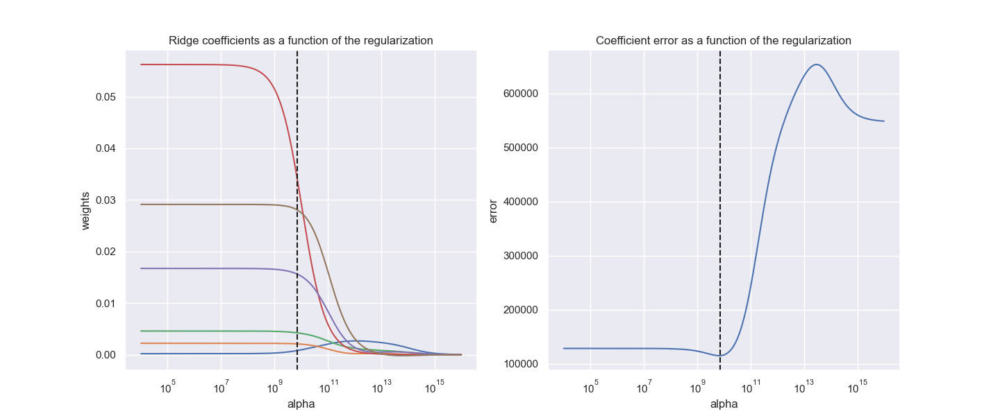
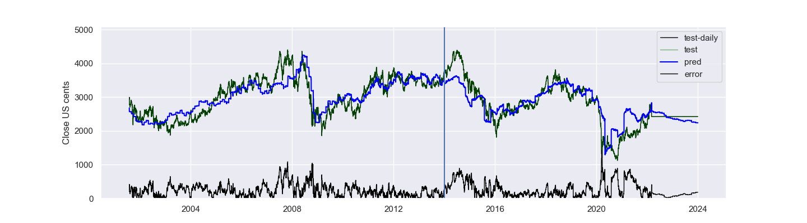

# RDSB Forecaster

### Important Note
This project is both a proof of concept and a work in progress.

I make no representation about the suitability of the information or data generated or described by the code for any purpose.
It is provided "as is" without express or implied warranty.
<b>
Put simply, any output or insight generated by this code, or any code derived from this code, should not be relied upon for 
making any investment decision.
</b>

### Overview
This project contains a simple ridge regression model to predict the Shell (ticker: SHEL) share price based on its fundamentals.
The default config fits performs a fit to 10 years' historical data commencing 2001-02-01.

Specifically, the target variable is the daily Shell spot close price in US cents. 
No adjustment for dividends is applied to this price series.

The model considers a number of features
(asterick indicates features in use for default config):
* Financials:
  * Income and balance sheet data(*)
  * Margins
  * Production volumes(*)
* Spot prices
  * Natural gas commercial(*)
  * WTI crude(*)
  * US Gasoline all retail(*)
  
### Usage
The model can be ran by running the below at the command line:
```
python rdsb_forecaster.py
```

Following this command, the below outputs should then be displayed
showing the ridge regression coeffients and error alpha dependency:

The Shell close price prediction (US cents) should then be output:


### Data links:
* data/eia/prices/energy_prices.csv: [[click here]](https://www.eia.gov/outlooks/steo/data/browser/#/?v=8&f=M&s=0&start=199701&end=202212&ctype=linechart&maptype=0&linechart=WTIPUUS)
* data/cmg/macrotrendsdotnet/wti-crude-oil-prices-10-year-daily-chart.csv: [[click here]](https://www.macrotrends.net/2516/wti-crude-oil-prices-10-year-daily-chart)

Currently unused data:
* data/cmg/brent-crude-oil-prices-10-year-daily-chart: [[click here]](https://www.macrotrends.net/2480/brent-crude-oil-prices-10-year-daily-chart)
* data/fxspot/GBPUSD.csv: [[click here]](https://uk.investing.com/currencies/gbp-usd-historical-data)
* data/RDSB/RDSB.L.csv: [[click here]](https://uk.finance.yahoo.com/quote/SHEL.L/history?p=SHEL.L)